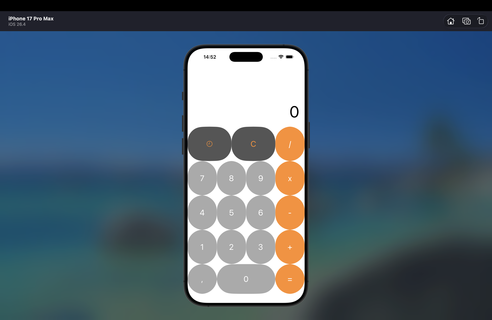

# iOS Calculator

Учебный проект калькулятора на Swift, выполненный в рамках курса «iOS для начинающих» от Т-Образования.

## О проекте

Это учебное iOS-приложение, созданное для практики базовых принципов мобильной разработки: работы с интерфейсом, обработки действий пользователя, навигации между экранами и сохранения данных.

## Скриншот

## Что реализовано

- ввод чисел и математических операций;
- отображение результата вычислений;
- экран истории операций;
- хранение истории вычислений;
- работа с коллекциями и ячейками;
- навигация между экранами;
- анимации;
- пасхалка при вводе числа π с шестью знаками после запятой.

## Чему я научился

Во время работы над проектом я получил первый практический опыт создания iOS-приложения в Xcode и начал лучше понимать, как связаны интерфейс, код и действия пользователя.

## Статус проекта

Учебный проект. Планирую дорабатывать его по мере изучения iOS-разработки.
